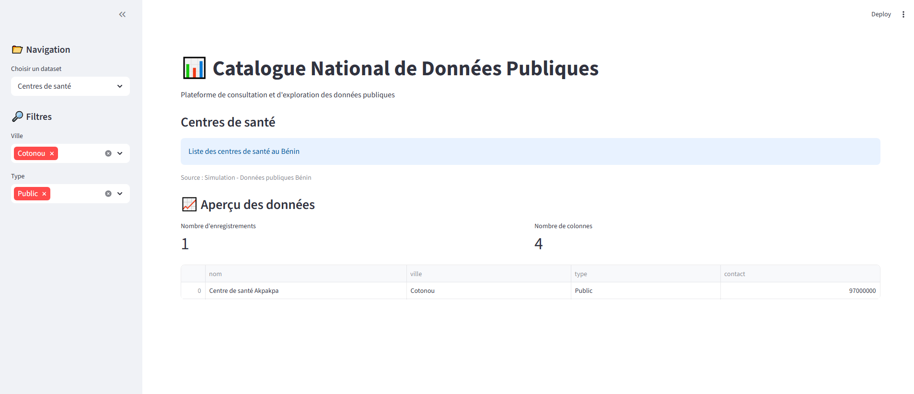

# 📊 Prototype de Catalogue de Données Publiques

## 🎯 Objectif

Ce projet propose un prototype de **catalogue de données publiques** visant à structurer, référencer et faciliter l’exploration de données issues de différentes structures administratives.

L’objectif est de répondre aux enjeux de :
- gouvernance des données
- réduction des silos informationnels
- amélioration de l’accès à l’information pour les décideurs et les développeurs

---

## 🧠 Contexte

Dans de nombreuses administrations, les données sont dispersées, hétérogènes et difficilement exploitables.

Ce prototype s’inscrit dans une logique de modernisation des systèmes d’information en permettant :
- une meilleure visibilité des données disponibles
- une standardisation des métadonnées
- une base pour le développement de plateformes Open Data

---

## ⚙️ Fonctionnalités

- 🔍 Scan automatique de fichiers de données (.csv, .xlsx)
- 🧾 Génération d’un catalogue structuré au format JSON
- 📊 Interface interactive de visualisation des datasets
- 🔎 Recherche et filtrage des données
- 🏷️ Ajout de métadonnées (source, description, type de données)

---

## 🧱 Architecture du projet

data-catalog-prototype/
│
├── data/
│ └── sample_datasets/
├── app.py
├── catalog.json
├── DataCatalog.png
├── requirements.txt
└── README.md

---

## 🛠️ Technologies utilisées

- Python
- Streamlit
- JSON

---

## ▶️ Lancer le projet

### 1. Installer les dépendances
pip install -r requirements.txt

### 2. Lancer l’application
streamlit run app.py

---

## 📸 Aperçu

---

## 🚀 Perspectives d’évolution

- Intégration d’un standard de métadonnées (DCAT-AP)
- Connexion à une base de données
- Gestion des rôles utilisateurs
- Publication automatique vers une plateforme Open Data

---

## 🎯 Valeur ajoutée

Ce projet démontre la capacité à :
- structurer des données hétérogènes
- mettre en place des outils de gouvernance des données
- concevoir des solutions orientées usage pour les administrations

---

## 👤 Auteur

Consultant indépendant en Data & Intelligence Artificielle  
Cotonou, Bénin

---

## ⚖️ Licence

MIT License
